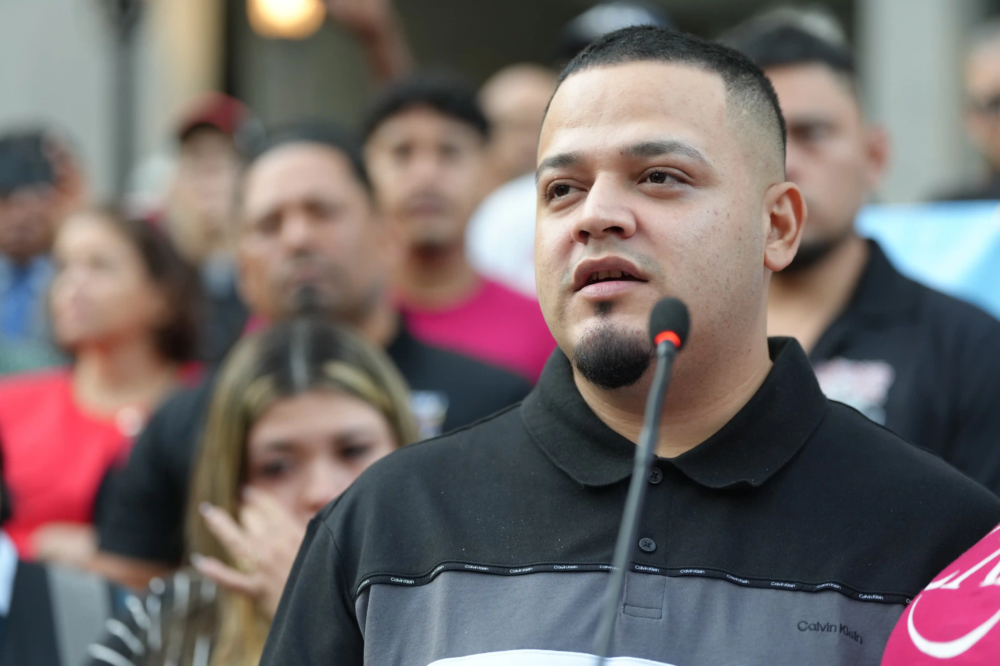

# 517-synk-immigration

Immigration Policy and Discourse in USA

## Immigration - Political and Media Discourse

One of the main areas that I have been researching in my papers for my graduate course work is the idea of belonging/othering and why Latin American US Citizens and Residents are portrayed as a threat via racist and stereotyped political- and media- discourse. It is a very interesting, but also extremely unfortunate issue that has come to the forefront of US politics since Donald Trump started running for president in 2015/2016, and it is currently wreaking havoc on many families in the United States. However, it is not really a new issue, but rather something that has building over the past century and has ramped up over the past 30 or so years.

### Background
There are 3 main phenomena that researchers believe set the stage for Donald Trump to be elected U.S. president, in part by campaigning on racist rhetoric where he, for example, blanketly accused Mexican people of being rapists and drug dealers:

1. Shifting ethnic makeup in historically white areas

    In the 1990s in the U.S., there was rapid growth in the Latin American population -- primarily folks from Mexico, but also other Central and South American countries -- especially in "New Destinations" for Latin American folks (as opposed to traditional destinations like California and the US-Southwest). Lots of people started moving to states like North Carolina, in part due to the availabillity of jobs in farming, construction, and service industry sectors, which were in part fueled by the Southeast's rapid development in recent years, but that's another story. Anyway, racist white people that lived in these areas felt uncomfortable that the ethnic makeup of their hometowns was shifting, and political and media pundits capitalized on that sense of uncomfortability to essentially fabricate an existential crisis in order to present themselves as the ones with the solution to it. Their solution is, deport people who aren't white, even if they're literally here legally or potentially even citizens. But, they leveraged their narrative even more over the next two decades using other historical events to bolster the notion that "foreigners" -- especially the non-white ones -- are endangering us.

2. September 11, 2001 Attacks

    A tragic event in U.S. history. Thousands of innocent people died. And in politics, tragedy represents political opportunity! Remember when everyone was like really afraid of anyone of Arabic origin being a terrorist? And that trickled into a pretty unfortunate period of Islamaphobia in the U.S., which included the passage of the civil rights-diminishing "Patriot Act"? Well, initially that racist, anti-immigrant sentiment was directed specifically at Muslims and people of Arabic and Middle Eastern origin, but overtime right-wing politicians and media pundits kind of just lumped it together with a burgeoning brand of white nationalism, in which lots of people were selling, and buying, the narrative that brown people are trying to kill us and destroy the United States. So, we have the "security" threat added to justify and rationalize the generalized uncomfortability with changing ethnic makeups. All we needed to seal the deal was an economic threat.

3. Financial Crisis of 2008

    A self-imposed financial crisis caused by extremely rich people being extremely greedy and extremely reckless with the general population's money, and using it to make risky bets that eventually self-imploded into the worst financial crisis since the great depression. But in the wake of millions of working-class people being economically decimated, with effects that still linger today, and of those same people actually literally bailing out those billionaires via their tax dollars, somehow the ire, at least for many people, is not directed at billionaires, but rather, the non-white immigrant, "coming in" and "using our resources" without paying their fair share. (The idea that immigrants do not pay taxes is a myth, see ["They take our jobs!": and 20 other myths about immigration](https://catalog.lib.ncsu.edu/catalog/NCSU4331456) by Aviva Chomsky)

But with further investigation, we can see that this racialized and anti-immigrant sentiment predates any of these recent events. These events were simply utilized as a lightning rod for politicians like Trump to galvanize support and take advantage of people's very real fear, born out of a combination of ignorance, poor media (and general) literacy, and a very real, human need for food, shelter, security, community, hope, etc.

### Stereotypes of Latin American Immigrants

I'm not going to write that much more, but here's an unnumbered list explaining why!
- I already wrote more than I intended.
- I'm tired.
- I also already wrote more than I intended to on my other repo.

But here is a link to a great book by the author Leo Chavez called [The Latino Threat](https://catalog.lib.ncsu.edu/catalog/NCSU6131044). Much of my research for this topic stemmed from his work. In his book, Chavez uses media analysis to explain how the current racist stereotypes of Latinos in US media and politics are not new. Rather, they can be traced back (at least) to old Hollywood Westerns where Mexicans (played by Italians) were stereotyped as "bandidos" and "harlots". And, he argues, those stereotypes never disappeared from popular media in the U.S. They were simply updated to jive with the times. You know, keep those stereotypes fresh!

Anyway, for purposes of demonstrating link skills and awkward transitions, here's a link to the next section, titled [Current Situation](#current-situation).

### Current Situation: 
... is really bad.

#### Remodeling US Justice System
... is something that is happening. Wild stuff!

#### Remodeling of Immigration and Deportation Policy
... also doing that. The government can apparently now disappear people to El Salvador and Uganda because they feel like it. Scary stuff!!!

Kilmar Abrego Garcia:

They've really got it out for this law-abiding, job-holding father and legal US-resident.

#### Student Visa Revocations
See the [Technician](https://technicianonline.com/75513/news/two-nc-state-students-leave-u-s-after-visas-terminated/) from April 1, 2025.

#### Who benefits

- Politicians seeking to position themselves as the sole authority to protect us from an imaginary crisis.
- The prison-industrial complex. Lots of companies make money off of full prisons.
- US gun manufacturers. I don't actually have any research to back this up at the moment, as I've never looked into it, but I imagine there are researchers talking about this. I also would imagine that a generalized sense of terror and paranoia tends to be good for business. Interestingly, US gun manufacturers are also a major source of arms for Mexican cartels. Neat! For some reason, no one in the United States ever talks about this. But ask your average Mexican citizen, they are well aware where the cartels' military-level firepower is sourced. I think the cartels probably also get guns from Russia, but certainly not exclusively. The largest and closest manufacturers of AR-15-style assault weapons are definitely just across the border!

### Sources

I didn't just make this up, although I wrote it as if I did. I do know how to cite academic sources, but luckily that wasn't a part of this assignment.

Here's sources that I have read and referred to in developing these perspectives and arguments:
[sources cited](https://docs.google.com/document/d/1L_d5lEM7UVWBYyWc0BBs5HFCy1lEqW3JWUZLJASnVSY/edit?usp=sharing)